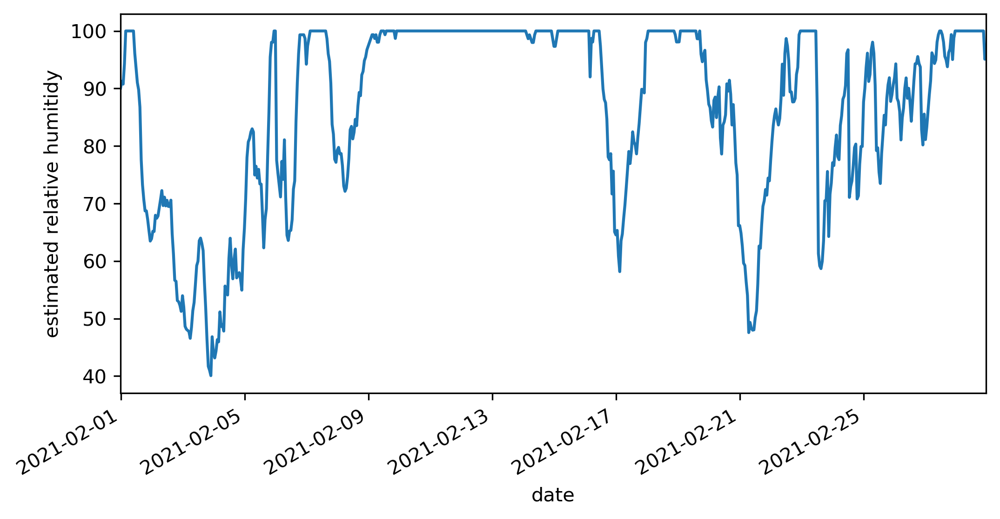
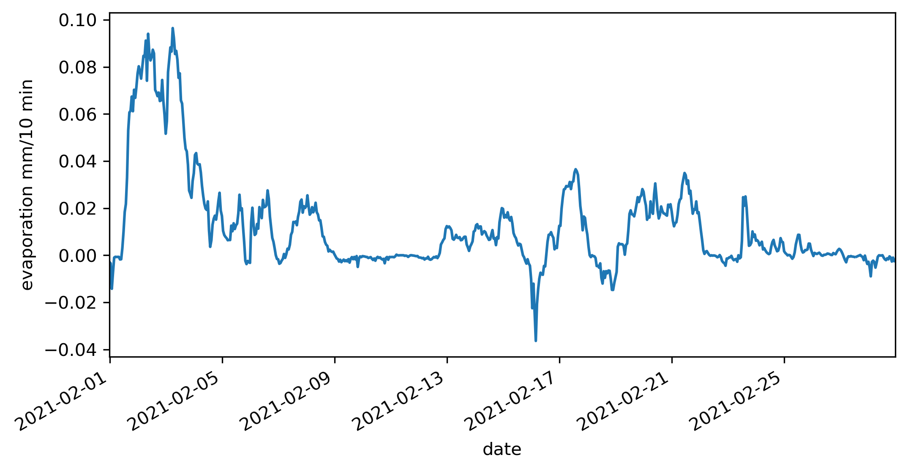

Tutorial
========

Basic usage with an example dataset. Note, this tutorial uses the
matplotlib graphing module which is *not* a dependency of ``AeroEvap``,
be sure to install it to your environment before running this tutorial
if you want the plots to display correctly.

    >>> import pandas as pd
    >>> import numpy as np
    >>> from aeroevap import Aero
    >>> from IPython.display import IFrame
    >>> import matplotlib.pyplot as plt
    >>> %matplotlib inline

Example data
------------

This example uses buoy data from a location near Savannah, GA (NOAA station ID
is 41008). The buoy is maintained by the National Data Buoy Center (NDBC), more
buoy information is shown in the embedded page below. The meterological data
used in this example is hosted by NOAA and downloaded directly and formatted
for a month of data.

.. raw:: html
    
    <iframe
        width="700"
        height="500"
        src="https://www.ndbc.noaa.gov/station_page.php?station=41008"
        frameborder="0"
        allowfullscreen
    ></iframe>

The line below downloads the time series of current year buoy standard
meterological data directly from the NDBC.

Input units:

==== ==== === ==== === === === ==== ==== ==== ==== === ====
WDIR WSPD GST WVHT DPD APD MWD PRES ATMP WTMP DEWP VIS TIDE
==== ==== === ==== === === === ==== ==== ==== ==== === ====
degT m/s  m/s m    sec sec deg hPa  degC degC degC nmi ft
==== ==== === ==== === === === ==== ==== ==== ==== === ====

    
    >>> # get standard meterological data from National Data Buoy Center
    >>> met_df = pd.read_csv(
    >>>     'https://www.ndbc.noaa.gov/data/l_stdmet/41008.txt', 
    >>>     delim_whitespace=True, skiprows=[1], na_values=[999.0]
    >>> )

Make a datetime index and clean up the dataframe.

    >>> met_df.index = pd.to_datetime(
    >>>     dict(
    >>>         year=met_df['#YY'], 
    >>>         month=met_df.MM, 
    >>>         day=met_df.DD, 
    >>>         hour=met_df.hh,
    >>>         minute=met_df.mm
    >>>     )
    >>> )
    >>> met_df.index.name = 'date'
    >>> met_df.drop(['#YY','MM','DD','hh','mm'], axis=1, inplace=True)
    >>> met_df.head()

.. raw:: html

    

    
    <table border="1" class="dataframe">
      <thead>
        <tr style="text-align: right;">
          <th></th>
          <th>WDIR</th>
          <th>WSPD</th>
          <th>GST</th>
          <th>WVHT</th>
          <th>DPD</th>
          <th>APD</th>
          <th>MWD</th>
          <th>PRES</th>
          <th>ATMP</th>
          <th>WTMP</th>
          <th>DEWP</th>
          <th>VIS</th>
          <th>TIDE</th>
        </tr>
        <tr>
          <th>date</th>
          <th></th>
          <th></th>
          <th></th>
          <th></th>
          <th></th>
          <th></th>
          <th></th>
          <th></th>
          <th></th>
          <th></th>
          <th></th>
          <th></th>
          <th></th>
        </tr>
      </thead>
      <tbody>
        <tr>
          <td>2021-01-31 23:50:00</td>
          <td>207</td>
          <td>7.0</td>
          <td>8.3</td>
          <td>1.52</td>
          <td>5.88</td>
          <td>4.90</td>
          <td>162</td>
          <td>1009.1</td>
          <td>15.9</td>
          <td>13.6</td>
          <td>14.3</td>
          <td>99.0</td>
          <td>99.0</td>
        </tr>
        <tr>
          <td>2021-02-01 00:50:00</td>
          <td>208</td>
          <td>8.0</td>
          <td>9.9</td>
          <td>1.38</td>
          <td>6.67</td>
          <td>4.91</td>
          <td>143</td>
          <td>1008.6</td>
          <td>15.7</td>
          <td>13.6</td>
          <td>14.3</td>
          <td>99.0</td>
          <td>99.0</td>
        </tr>
        <tr>
          <td>2021-02-01 01:50:00</td>
          <td>216</td>
          <td>10.3</td>
          <td>11.8</td>
          <td>1.58</td>
          <td>6.25</td>
          <td>4.79</td>
          <td>157</td>
          <td>1007.8</td>
          <td>17.2</td>
          <td>13.7</td>
          <td>15.7</td>
          <td>99.0</td>
          <td>99.0</td>
        </tr>
        <tr>
          <td>2021-02-01 02:50:00</td>
          <td>273</td>
          <td>8.5</td>
          <td>11.6</td>
          <td>1.55</td>
          <td>5.88</td>
          <td>5.01</td>
          <td>151</td>
          <td>1008.3</td>
          <td>15.9</td>
          <td>13.7</td>
          <td>15.0</td>
          <td>99.0</td>
          <td>99.0</td>
        </tr>
        <tr>
          <td>2021-02-01 03:50:00</td>
          <td>320</td>
          <td>2.5</td>
          <td>3.5</td>
          <td>1.45</td>
          <td>6.67</td>
          <td>5.43</td>
          <td>140</td>
          <td>1008.5</td>
          <td>14.6</td>
          <td>13.7</td>
          <td>14.6</td>
          <td>99.0</td>
          <td>99.0</td>
        </tr>
      </tbody>
    </table>
    

     

Because the input dataset does not include relative humitidy we can
estimate it using an approximation to the Clausius–Clapeyron relation
using air and dewpoint temperatures. Relative humitidy is needed in the
aerodynamic mass-transfer evaporation calculations.

    >>> # vapor pressure and saturation vapor pressure using Clausius–Clapeyron relation
    >>> met_df['e'] = 0.611 * np.exp( 5423 * ((1/273) - (1/(met_df.DEWP+273.15))) )
    >>> met_df['es'] = 0.611 * np.exp( 5423 * ((1/273) - (1/(met_df.ATMP+273.15))) )

    >>> # calculate relative humitidy
    >>> met_df['RH'] = 100 * (met_df.e/met_df.es)
    >>> plt.figure(figsize=(8,4))
    >>> met_df.RH.plot()
    >>> plt.ylabel('estimated relative humitidy')

In this case we do *not* need to convert air pressure to millibars
because 1 hPa = 1 mbar.

Create an :obj:`.Aero` object
-----------------------------

The :obj:`.Aero` object allows for loading a :obj:`pandas.DataFrame` containing
meterological data required for calculating aerodynamic mass-transfer
open water evaporation in parrallel. The object can be initialized from
a :obj:`pandas.DataFrame` or the :obj:`pandas.DataFrame` can be assigned
later, e.g.

    >>> Aero_empty = Aero()
    >>> Aero_with_df = Aero(met_df)

    >>> Aero_empty.df is None
        True

    >>> # the df property can be assigned after initialization:
    >>> Aero_empty.df = met_df

    >>> # the data has been added
    >>> Aero_empty.df.head()

.. raw:: html

    

    
    <table border="1" class="dataframe">
      <thead>
        <tr style="text-align: right;">
          <th></th>
          <th>WDIR</th>
          <th>WSPD</th>
          <th>GST</th>
          <th>WVHT</th>
          <th>DPD</th>
          <th>APD</th>
          <th>MWD</th>
          <th>PRES</th>
          <th>ATMP</th>
          <th>WTMP</th>
          <th>DEWP</th>
          <th>VIS</th>
          <th>TIDE</th>
          <th>e</th>
          <th>es</th>
          <th>RH</th>
        </tr>
        <tr>
          <th>date</th>
          <th></th>
          <th></th>
          <th></th>
          <th></th>
          <th></th>
          <th></th>
          <th></th>
          <th></th>
          <th></th>
          <th></th>
          <th></th>
          <th></th>
          <th></th>
          <th></th>
          <th></th>
          <th></th>
        </tr>
      </thead>
      <tbody>
        <tr>
          <td>2021-01-31 23:50:00</td>
          <td>207</td>
          <td>7.0</td>
          <td>8.3</td>
          <td>1.52</td>
          <td>5.88</td>
          <td>4.90</td>
          <td>162</td>
          <td>1009.1</td>
          <td>15.9</td>
          <td>13.6</td>
          <td>14.3</td>
          <td>99.0</td>
          <td>99.0</td>
          <td>1.658512</td>
          <td>1.841077</td>
          <td>90.083807</td>
        </tr>
        <tr>
          <td>2021-02-01 00:50:00</td>
          <td>208</td>
          <td>8.0</td>
          <td>9.9</td>
          <td>1.38</td>
          <td>6.67</td>
          <td>4.91</td>
          <td>143</td>
          <td>1008.6</td>
          <td>15.7</td>
          <td>13.6</td>
          <td>14.3</td>
          <td>99.0</td>
          <td>99.0</td>
          <td>1.658512</td>
          <td>1.817315</td>
          <td>91.261670</td>
        </tr>
        <tr>
          <td>2021-02-01 01:50:00</td>
          <td>216</td>
          <td>10.3</td>
          <td>11.8</td>
          <td>1.58</td>
          <td>6.25</td>
          <td>4.79</td>
          <td>157</td>
          <td>1007.8</td>
          <td>17.2</td>
          <td>13.7</td>
          <td>15.7</td>
          <td>99.0</td>
          <td>99.0</td>
          <td>1.817315</td>
          <td>2.002412</td>
          <td>90.756312</td>
        </tr>
        <tr>
          <td>2021-02-01 02:50:00</td>
          <td>273</td>
          <td>8.5</td>
          <td>11.6</td>
          <td>1.55</td>
          <td>5.88</td>
          <td>5.01</td>
          <td>151</td>
          <td>1008.3</td>
          <td>15.9</td>
          <td>13.7</td>
          <td>15.0</td>
          <td>99.0</td>
          <td>99.0</td>
          <td>1.736292</td>
          <td>1.841077</td>
          <td>94.308483</td>
        </tr>
        <tr>
          <td>2021-02-01 03:50:00</td>
          <td>320</td>
          <td>2.5</td>
          <td>3.5</td>
          <td>1.45</td>
          <td>6.67</td>
          <td>5.43</td>
          <td>140</td>
          <td>1008.5</td>
          <td>14.6</td>
          <td>13.7</td>
          <td>14.6</td>
          <td>99.0</td>
          <td>99.0</td>
          <td>1.691456</td>
          <td>1.691456</td>
          <td>100.000000</td>
        </tr>
      </tbody>
    </table>
    

.. raw:: html

    

You may only assign a :obj:`pandas.DataFrame` to :attr:`.Aero.df`,

    >>> # this will not work, df needs to be a dataframe
    >>> Aero_empty.df = 'high five'

::

    ---------------------------------------------------------------------------

    TypeError                                 Traceback (most recent call last)

    <ipython-input-13-5de371e56275> in <module>
          1 # this will not work, df needs to be a dataframe
    ----> 2 Aero_empty.df = 'high five'
    

    ~/AeroEvap/aeroevap/aero.py in df(self, df)
        122     def df(self, df):
        123         if not isinstance(df, pd.DataFrame):
    --> 124             raise TypeError("Must assign a pandas.DataFrame object")
        125         self._df = df
        126 

    TypeError: Must assign a pandas.DataFrame object

.. Tip:: 
   The ``df`` is a property of the :obj:`.Aero` class which means it can be
   assigned or reassigned if, for example, you wanted to run the evaporation
   calculations on a modified version of input meterological time series
   without creating a new :obj:`.Aero` instance.

Input variables and units
-------------------------

The meterological variables needed for running the aerodynamic
mass-transfer estimation of evaporation are the following:

================= ===== ======
variable          units naming
================= ===== ======
wind speed        m/s   WS
air pressure      mbar  P
air temperature   C     T_air
skin temperature  C     T_skin
relative humidity 0-100 RH
================= ===== ======

where the “naming” column refers to the internal names expected by the
:meth:`.Aero.run` method, i.e. the column headers in the dataframe should
either be named accordingly or a dictionary that maps your column names
to those internal names can be passed (see examples below).

To run the evaporation calculation you will also need the anemometer
height in meters and the temporal sampling frequency of the data in
seconds.

Run calculation on time series
------------------------------

As mentioned, this dataset has unique naming conventions, therefore we need to tell ``AeroEvap`` which variables are which with a dictionary,

    >>> # make a naming dict to match up columns with Aero variable names
    >>> names = {
    >>>     'WSPD' : 'WS',
    >>>     'ATMP' : 'T_air',
    >>>     'WTMP' : 'T_skin',
    >>>     'PRES' : 'P'
    >>> }

Alternatively you could rename wind speed, air and surface temperature, and air pressure columns to the apprpriate names specified in the table above in :ref:`Input variables and units`.

Now we are ready to run the aerodynamic mass-transer evaporation on the full
time series in our dataframe. Lastly, the sensor height of the anemometer and
temporal sampling frequency of the data needs to be supplied, in this case the
height is 4 meters and the data frequency is 10 minutes or 600 seconds.

This example assumes there are 8 physical or logical processors
available for parallelization, if not specified the :meth:`.Aero.run` routine
will attempt to use half of the available processors.

    >>> np.seterr('ignore')
    >>> # create a new Aero object and calculate evaporation on all rows
    >>> A = Aero(met_df)
    >>> A.run(sensor_height=4, timestep=600, variable_names=names)

After the calculations are complete three variables will be added to the :attr:`.Aero.df` dataframe: 'E', 'Ce', 'VPD', and 'stability' which are evaporation in mm/timestep, bulk transfer coefficient, vapor pressure deficit (kPa), and the Monin-Obhukov Similarity Theory (MOST) stability parameter (z/L). 

    >>> A.df[['E', 'Ce', 'VPD', 'stability']].head()

.. raw:: html

    

    
    <table border="1" class="dataframe">
      <thead>
        <tr style="text-align: right;">
          <th></th>
          <th>E</th>
          <th>Ce</th>
          <th>VPD</th>
          <th>stability</th>
        </tr>
        <tr>
          <th>date</th>
          <th></th>
          <th></th>
          <th></th>
          <th></th>
        </tr>
      </thead>
      <tbody>
        <tr>
          <td>2021-01-31 23:50:00</td>
          <td>-0.002865</td>
          <td>0.001296</td>
          <td>-0.069970</td>
          <td>0.075544</td>
        </tr>
        <tr>
          <td>2021-02-01 00:50:00</td>
          <td>-0.003473</td>
          <td>0.001368</td>
          <td>-0.070289</td>
          <td>0.048386</td>
        </tr>
        <tr>
          <td>2021-02-01 01:50:00</td>
          <td>-0.014245</td>
          <td>0.001443</td>
          <td>-0.213278</td>
          <td>0.042489</td>
        </tr>
        <tr>
          <td>2021-02-01 02:50:00</td>
          <td>-0.007264</td>
          <td>0.001391</td>
          <td>-0.136129</td>
          <td>0.043363</td>
        </tr>
        <tr>
          <td>2021-02-01 03:50:00</td>
          <td>-0.000994</td>
          <td>0.000932</td>
          <td>-0.094175</td>
          <td>0.367295</td>
        </tr>
      </tbody>
    </table>
    

View the calculated evaporation,

    >>> plt.figure(figsize=(8,4))
    >>> A.df.E.plot()
    >>> plt.ylabel('evaporation mm/10 min')

The calculated open-water evaporation is shown below after creating a
daily sum.

    >>> plt.figure(figsize=(8,4))
    >>> A.df.E.resample('D').sum().plot()
    >>> plt.ylabel('evaporation mm/day')

.. figure:: _static/evap_daily.png

And the wind speed relation versus the calculated evaporation.

    >>> plt.figure(figsize=(8,4))
    >>> plt.scatter(A.df.WSPD.resample('D').mean(), A.df.E.resample('D').sum())
    >>> plt.ylabel('evaporation mm/day')
    >>> plt.xlabel('mean daily wind speed m/s')
    
.. figure:: _static/wind_vs_evap.png

We can use the MOST stability parameter for relating the wind speed to the bulk transfer coefficient as well by classifying them by unstable, stable, and neutral conditions.

    >>> stable = np.real(A.df.stability) > 0 
    >>> unstable = np.real(A.df.stability) < 0
    >>> neutral = np.real(A.df.stability) == 0

    >>> plt.figure(figsize=(8,6))
    >>> plt.scatter(A.df.WSPD[stable], A.df.Ce[stable], marker='x', color='blue', label='stable')
    >>> plt.scatter(A.df.WSPD[unstable], A.df.Ce[unstable], marker='x', color='red', label='unstable')
    >>> plt.scatter(A.df.WSPD[neutral], A.df.Ce[neutral], marker='o', color='black', label='neutral')
    >>> plt.ylim(0,0.006)
    >>> plt.ylabel(r'$C_e$', fontsize=12)
    >>> plt.xlabel('Wind speed m/s')
    >>> plt.legend()

Single calculation
------------------

The :obj:`.Aero` class also provides a method :meth:`.Aero.single_calc` that can
be used on a single set of meterological data to calculate the
instantaneous open-water evaporation. It requires the same inputs as
:meth:`.Aero.run` however the inputs are scalars as opposed to time series.
For example using the first timestamp of our example buoy data we can
calculate E, Ce, VPD, and stability:

    >>> datetime = '2019-08-01 00:00:00'
    >>> wind = 3.3
    >>> pressure = 1021.2
    >>> T_air = 18.1
    >>> T_skin = 18.4
    >>> RH = 80.26
    >>> sensor_height = 4
    >>> timestep = 600
    >>> E, Ce, VPD, stability = Aero.single_calc(
    >>>     datetime,
    >>>     wind,
    >>>     pressure,
    >>>     T_air,
    >>>     T_skin,
    >>>     RH,
    >>>     sensor_height,
    >>>     timestep
    >>> )

    >>> E, Ce, VPD, stability
        (0.008724959939647368, 0.001310850807452679, 0.44947250457458576, -0.049355020952319244)

Theory behind calculations
--------------------------

This is a work in progress, for now please refer to `references hosted on GitHub <https://github.com/WSWUP/AeroEvap/tree/master/references>`_ about the methodologies used.
